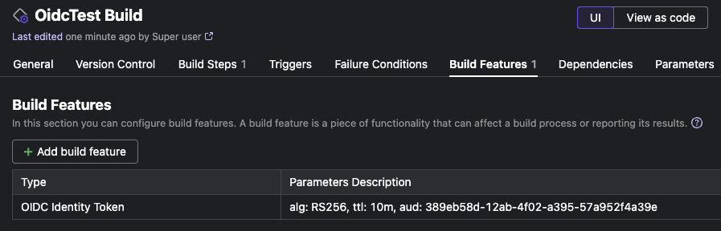
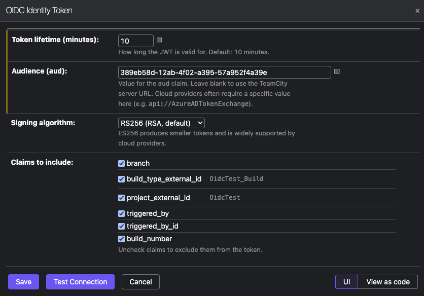
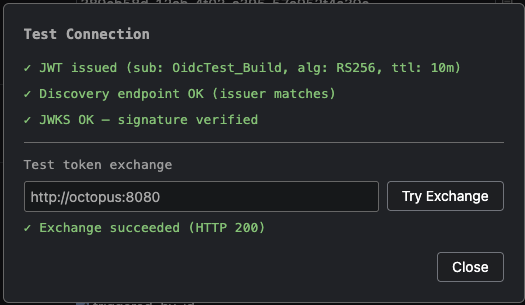

# TeamCity OIDC Plugin

A TeamCity plugin that turns your TeamCity server into an OIDC identity provider, enabling workload identity federation with cloud services — no static credentials required.

When a build starts, the plugin issues a signed JWT and injects it as a masked build parameter (`jwt.token`). Cloud providers (AWS, Azure, GCP, Octopus Deploy) can verify the token against the plugin's public JWKS endpoint and grant access based on claims in the token.

## Requirements

- TeamCity 2025.11+
- The TeamCity server root URL must be configured as `https://`

## Installation

Copy the plugin zip to `<TeamCity data directory>/plugins/` and restart TeamCity.

## Setup

1. Add the **OIDC Identity Token** build feature to a build configuration.
2. Configure the audience (`aud`) to match what your cloud provider expects.
3. In your cloud provider, create an OIDC identity that trusts your TeamCity server as the issuer and configure conditions based on the token claims.



## OIDC Endpoints

The plugin serves two public endpoints (no authentication required):

| Endpoint | Description |
|---|---|
| `GET /.well-known/openid-configuration` | OIDC discovery document |
| `GET /.well-known/jwks.json` | Public key set for signature verification |

The issuer is your TeamCity root URL (e.g. `https://teamcity.example.com`).

## Token

The token is injected as the masked build parameter `jwt.token`. Reference it in build steps as `%jwt.token%`.

### Standard claims

| Claim | Value |
|---|---|
| `sub` | Build type external ID (e.g. `MyProject_Build`) |
| `iss` | TeamCity root URL |
| `aud` | Configured audience (defaults to TeamCity root URL) |
| `iat` / `exp` | Issued at / expiry (configurable TTL, default 10 minutes) |
| `jti` | Unique token ID (`<buildId>-<uuid>`) |

### Optional claims

Configurable per build feature instance:

| Claim | Description |
|---|---|
| `branch` | Branch name |
| `build_type_external_id` | Build type external ID |
| `project_external_id` | Project external ID |
| `triggered_by` | Human-readable trigger description |
| `triggered_by_id` | User ID (omitted for automated triggers) |
| `build_number` | Build number string |

## Build Feature Configuration



| Field | Description |
|---|---|
| Token lifetime | How long the JWT is valid (default: 10 minutes) |
| Audience | Value for the `aud` claim. Cloud providers often require a specific value (e.g. `api://AzureADTokenExchange`) |
| Signing algorithm | RS256 (RSA, default) or ES256 (ECDSA P-256) |
| Claims to include | Select which optional claims to include in the token |

## Test Connection



The build feature configuration page includes a **Test Connection** button that:

1. Issues a test JWT using the current configuration
2. Verifies the OIDC discovery endpoint is reachable
3. Verifies the token signature against the JWKS endpoint
4. Optionally attempts an OIDC token exchange against a target service URL

## Key Rotation

To rotate keys, `POST` to `/admin/jwtKeyRotate.html` (requires `MANAGE_SERVER_INSTALLATION` permission). The previous keys remain in the JWKS for one overlap window so in-flight tokens continue to verify.

## Building

```
mvn package -pl oidc-plugin-server -am -DskipTests
```

The plugin zip is written to `target/teamcity-oidc-plugin.zip`.
