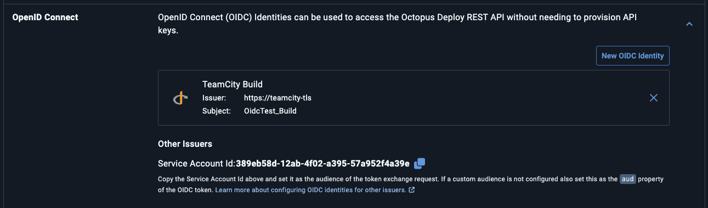

# Configuration Reference

## Build feature

Add the **OIDC Identity Token** build feature to a build configuration. Multiple instances are allowed if you need tokens for different audiences.

| Field | Description |
|---|---|
| Token lifetime | How long the JWT is valid (1–1440 minutes, default 10). Set this to the minimum needed by your build steps. |
| Audience | Value for the `aud` claim. Cloud providers typically require a specific value (e.g. `api://AzureADTokenExchange` for Azure, the service account ID for Octopus Deploy). Defaults to the TeamCity root URL. |
| Signing algorithm | RS256 (RSA-2048, default), RS384 (RSA-3072), or ES256 (ECDSA P-256). |
| Claims to include | Select which optional claims to include. All are included by default. |

## Token claims

Reference the token in build steps as `%jwt.token%`. It is injected as a masked parameter, so its value is redacted in build logs.

### Standard claims

| Claim | Value |
|---|---|
| `sub` | Build type external ID (e.g. `MyProject_Build`) |
| `iss` | TeamCity root URL |
| `aud` | Configured audience (defaults to TeamCity root URL) |
| `iat` / `nbf` / `exp` | Issued at / not before / expiry (based on configured TTL) |
| `jti` | Unique token ID (`<buildId>-<uuid>`) |

### Optional claims

| Claim | Description |
|---|---|
| `branch` | Branch name |
| `build_type_external_id` | Build type external ID (same as `sub`) |
| `project_external_id` | Project external ID |
| `triggered_by` | Human-readable trigger description |
| `triggered_by_id` | User ID (omitted for automated triggers) |
| `build_number` | Build number string |

## Octopus Deploy

In Octopus Deploy, go to **Configuration → Users → Your Service Account → OpenID Connect** and create a new OIDC Identity.

- Set the **issuer** to your TeamCity root URL.
- Set the **subject** to the build type external ID.
- Copy the **Service Account Id** and use it as the **Audience** in the build feature configuration.

