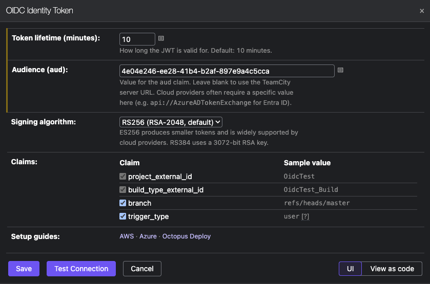
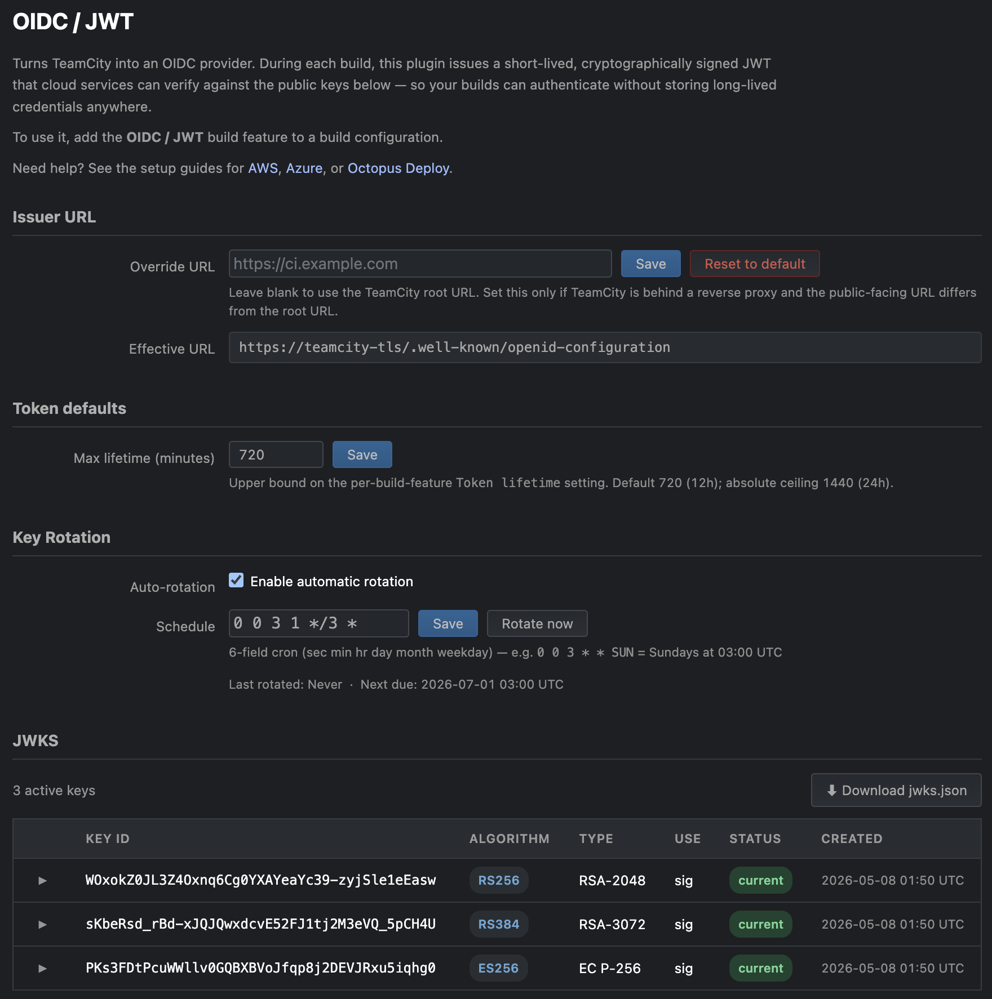

# Configuration Reference

## Build feature

Add the **OIDC Identity Token** build feature to a build configuration. Multiple instances are allowed if you need tokens for different audiences.



| Field | Description |
|---|---|
| Token lifetime | How long the JWT is valid (default 10 minutes). The upper bound is the **Max lifetime** configured under Administration → OIDC / JWT (defaults to 720 minutes / 12 hours). Set this to the minimum needed by your build steps. |
| Audience | Value for the `aud` claim. Cloud providers typically require a specific value (e.g. `api://AzureADTokenExchange` for Azure, the service account ID for Octopus Deploy). Defaults to the TeamCity root URL. |
| Signing algorithm | RS256 (RSA-2048, default), RS384 (RSA-3072), or ES256 (ECDSA P-256). |
| Subject scoping | Which optional dimensions are appended to the composite `sub` claim. None are included by default, so `sub` is just `project:<id>:build_type:<id>` and a single consumer-side trust binding matches every build of this build type. Opt in to `branch` and/or `trigger_type` for tighter scoping. See [Subject claim](#subject-claim) below. |

## Connections

A **Connection** is a reusable bundle of OIDC issuance settings (audience, token
lifetime, signing algorithm, subject scoping) defined at the project level.
Multiple build features can reference the same connection.

### Creating a connection

1. Navigate to **Project Admin → Connections → Add connection**.
2. Pick **OIDC Identity Token**.
3. Fill in the display name, audience, lifetime, signing algorithm, and subject
   scoping; click **Preview sample token** to see the resulting `sub` and `aud`.
4. Save.

Connections defined at a parent project are inherited by all sub-projects —
define once at the top of the hierarchy where it makes sense.

### Using a connection

1. Open the build feature editor.
2. Pick the connection from the **Connection** dropdown at the top.
3. The inline audience / TTL / algorithm / subject scoping fields hide; a
   read-only summary of the connection's settings appears.

### What happens if the connection is deleted?

- At save time, the build feature editor reports an `InvalidProperty` error on
  the connection field if the referenced connection is no longer reachable.
- At build start, if the connection still cannot be resolved (e.g. it was
  deleted between the last save and the build), the build fails with a clear
  error message identifying the missing connection. **No tokens are issued
  with surprise claims.**

### Coexistence with inline configuration

Inline (per-build-feature) configuration remains fully supported. Connections
are optional and additive — pick "(no connection — configure inline below)" in
the dropdown to use the existing inline fields.

## Token claims

Reference the token in build steps as `%jwt.token%`. It is injected as a masked parameter, so its value is redacted in build logs.

### Subject claim

The `sub` claim is composed as a colon-separated key:value string in the style used by GitHub Actions and recommended by Octopus Deploy:

```
project:<project_internal_id>:build_type:<build_type_internal_id>[:branch:<branch>][:trigger_type:<trigger>]
```

The `project` and `build_type` segments are always present and use TeamCity's **internal** IDs (e.g. `project7`, `bt42`) because those are immutable across renames. The `branch` and `trigger_type` segments are appended only when the corresponding **Subject scoping** checkbox is enabled in the build feature.

Examples:

- `project:project7:build_type:bt42` — minimal sub, no optional dimensions
- `project:project7:build_type:bt42:branch:refs/heads/main:trigger_type:user` — full sub

Consumers like Octopus Deploy match `sub` with wildcards (`*` and `?`), so `project:project7:build_type:bt42:branch:refs/heads/main:*` is a typical trust policy expression.

### Standard claims

All claims listed below are **always** emitted in the token, regardless of the **Subject scoping** configuration. The checkboxes only control which dimensions appear in `sub`.

| Claim | Value |
|---|---|
| `sub` | Composite identifier (see [Subject claim](#subject-claim)) |
| `iss` | TeamCity root URL |
| `aud` | Configured audience (defaults to TeamCity root URL) |
| `iat` / `nbf` / `exp` | Issued at / not before / expiry (based on configured TTL) |
| `jti` | Unique token ID (`<buildId>-<uuid>`) |
| `build_type_internal_id` | Build type internal ID (e.g. `bt42`) — immutable across renames |
| `project_internal_id` | Project internal ID (e.g. `project7`) — immutable across renames |
| `build_type_external_id` | Build type external ID (e.g. `MyProject_Build`) — human-readable; changes if an admin renames the build type |
| `project_external_id` | Project external ID (e.g. `MyProject`) — human-readable; changes if an admin renames the project |
| `branch` | Branch name (e.g. `refs/heads/main`). Default-branch builds are reported as the VCS root's configured default branch ref, not TeamCity's `<default>` marker. Omitted from the token entirely when the build has no branch (typically because the build configuration has no VCS root attached). |
| `trigger_type` | How the build was triggered: `user`, `snapshotDependency`, the trigger's `type` parameter (e.g. `vcsTrigger`, `schedulingTrigger`), or `unknown` |

## Server-wide settings

Configure these under **Administration → OIDC / JWT**.



| Setting | Description |
|---|---|
| Override issuer URL | Override the `iss` claim and the discovery endpoint's `issuer`. Set this only if TeamCity is behind a reverse proxy and the public-facing URL differs from the server's root URL. |
| Max lifetime (minutes) | Upper bound on the per-build-feature **Token lifetime** setting. Defaults to 720 (12 hours). The hard ceiling is 1440 (24 hours): no mainstream cloud OIDC consumer (AWS IAM, Azure workload identity federation, GCP, GitHub Actions) accepts tokens with a longer lifetime, so allowing more would only let users configure builds that produce tokens guaranteed to be rejected. |
| JWKS cache lifetime (minutes) | Default 10. Range 1–1440. Controls two things: (1) the `Cache-Control: max-age=` and `stale-while-revalidate=` values on the `/.well-known/jwks.json` and `/.well-known/openid-configuration` endpoints (in seconds = minutes × 60); (2) the post-rotation warmup window — a newly-rotated key is published in JWKS immediately but does not sign tokens for this many minutes. See [Rotation warmup](key-management.md#rotation-warmup). |

## Cloud provider setup guides

- [AWS](aws.md) — IAM OIDC federation, trust policy, using the token with the AWS CLI/SDK
- [Azure](azure.md) — workload identity federation, federated credentials, Azure PowerShell login
- [JFrog Artifactory](artifactory.md) — OIDC integration, identity mappings, pushing Docker images
- [Octopus Deploy](octopus-deploy.md) — OIDC identity setup for Octopus Deploy

