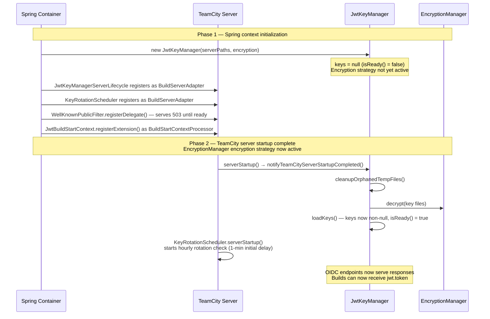

# Development

## Building

```
mvn package -pl oidc-plugin-server -am -DskipTests
```

The plugin zip is written to `target/Octopus.TeamCity.OIDC.1.0-SNAPSHOT.zip`.

See [`CLAUDE.md`](../CLAUDE.md) for full local development instructions including manual testing with a live stack.

## Plugin architecture

### Startup sequence

The key manager cannot decrypt key files until TeamCity's `EncryptionManager` has initialised its encryption strategy, which happens during server startup — after all Spring beans have been constructed. This creates a two-phase startup:

1. **Spring construction** — all plugin beans are instantiated and register themselves with TeamCity extension points. The key manager holds `null` keys; OIDC endpoints return `503 Service Unavailable`.
2. **Server startup event** — TeamCity fires `serverStartup()` on all `BuildServerAdapter` listeners. The key manager loads keys from disk; OIDC endpoints begin serving responses.



> **Hot-deploy note:** When the plugin is deployed to a running server, `serverStartup()` never fires. `KeyRotationScheduler` handles this by checking `buildServer.isStarted()` in its constructor and starting the scheduler immediately if the server is already up. `JwtKeyManagerServerLifecycle` does not have equivalent handling — key loading must be triggered via the TeamCity plugin reload mechanism.
