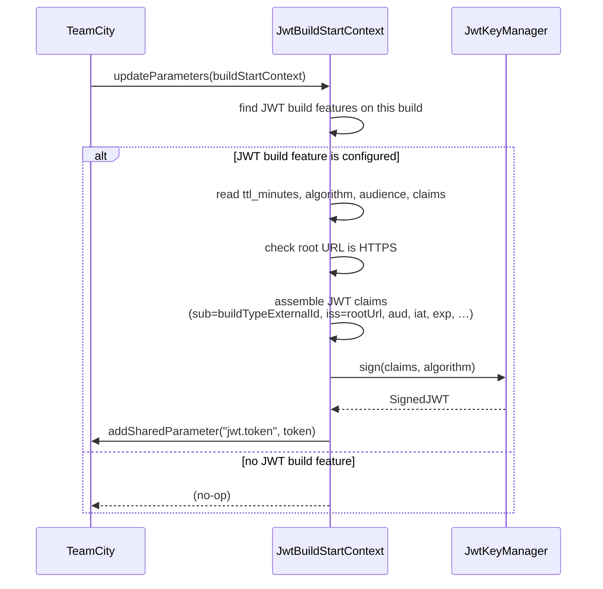
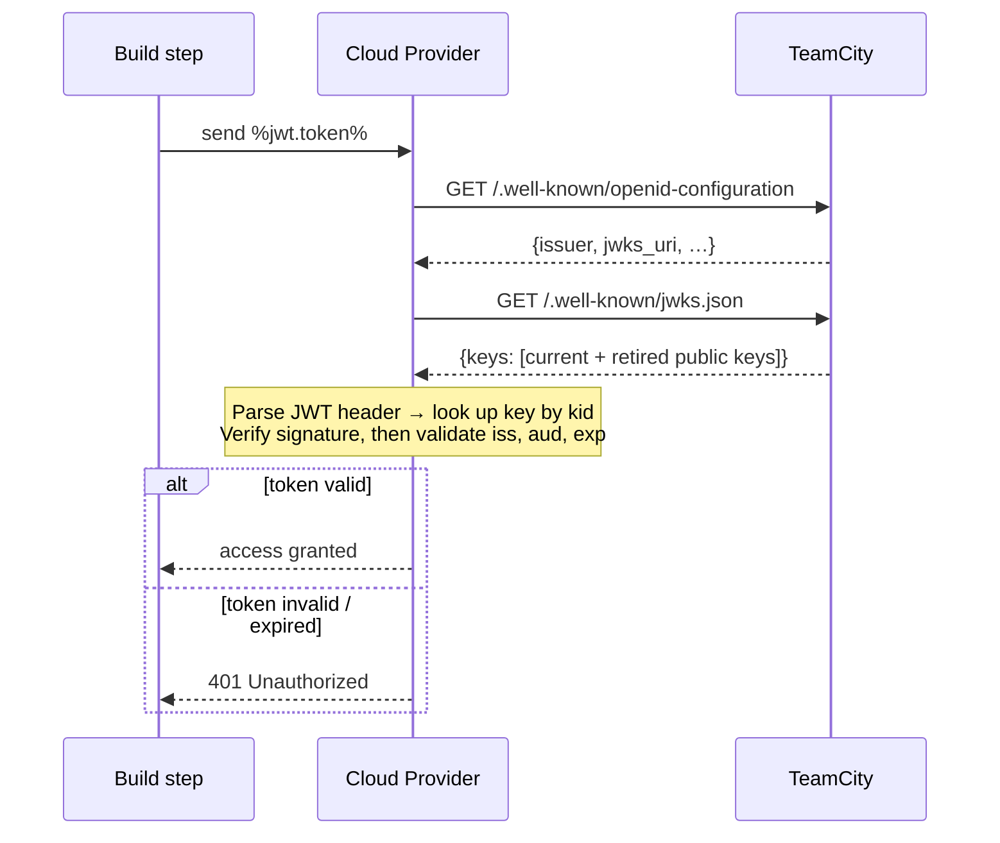
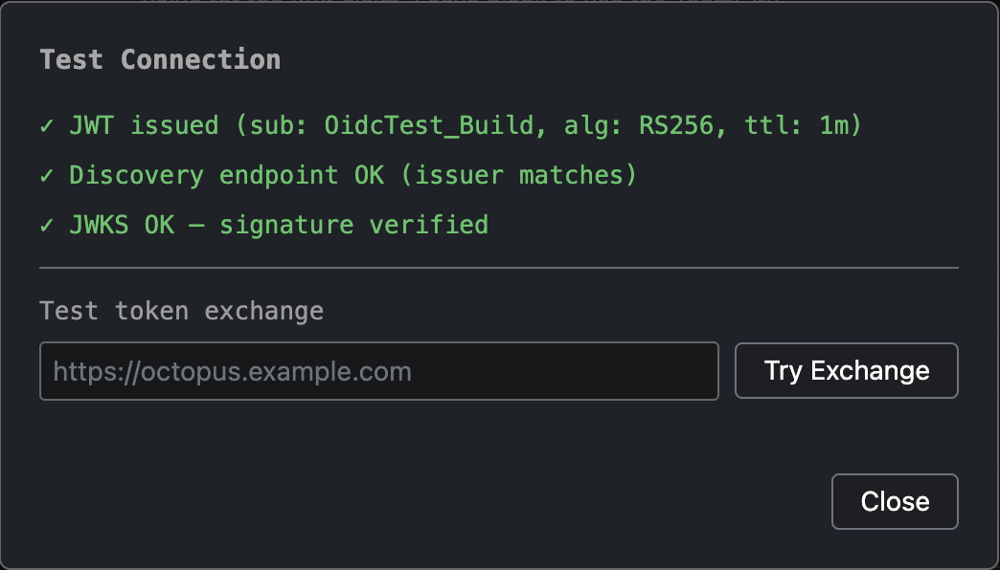
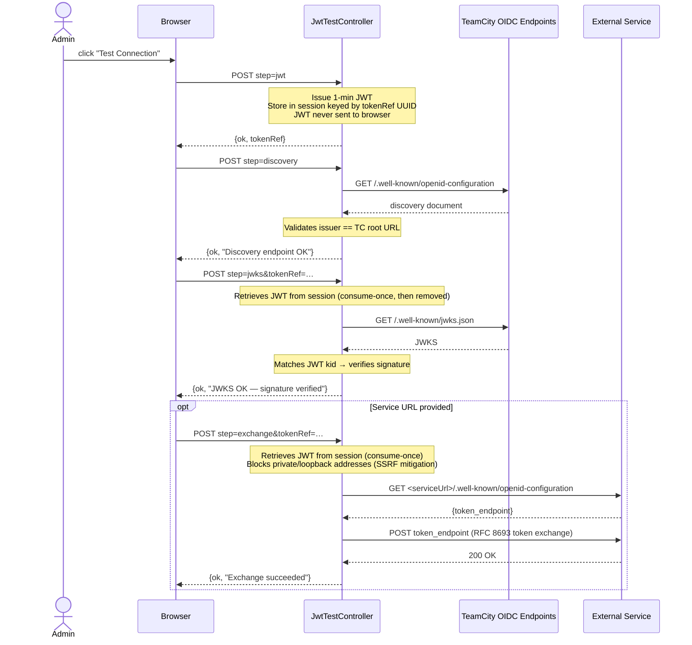

# How It Works

The plugin hooks into TeamCity's build lifecycle and exposes standard OIDC endpoints. No changes to your build agent or network infrastructure are required.

## JWT issuance

Just before a build is dispatched to an agent, TeamCity calls every registered `BuildStartContextProcessor`. The plugin checks whether the build has an OIDC Identity Token feature configured and, if so, signs a JWT and injects it as the masked parameter `jwt.token`.

## Token verification by relying parties (e.g. cloud providers)

A build step sends `%jwt.token%` to the cloud provider (e.g. as a header or request body). The provider verifies it using the standard OIDC discovery protocol — no prior configuration of public keys is needed.

The JWKS endpoint always includes one generation of retired keys alongside the current keys. Tokens issued just before a rotation continue to verify for the remainder of their TTL.

## OIDC endpoints

The plugin serves two public endpoints (no authentication required):

| Endpoint | Description |
|---|---|
| `GET /.well-known/openid-configuration` | OIDC discovery document |
| `GET /.well-known/jwks.json` | Public key set for signature verification |

The issuer is your TeamCity root URL (e.g. `https://teamcity.example.com`).

Both endpoints return `503 Service Unavailable` during server startup while keys are being loaded.

## Test Connection

The build feature configuration page includes a **Test Connection** button that runs a four-step verification from the server (not the browser):

1. Issues a test JWT using the current configuration
2. Verifies the OIDC discovery endpoint is reachable and the issuer matches
3. Fetches the JWKS and verifies the token signature
4. Optionally attempts an OIDC token exchange against a target service URL

The raw JWT is stored in the server-side HTTP session and never sent to the browser — only a UUID reference (`tokenRef`) travels between steps. Each step consumes the token reference once and removes it from the session.

> **Permissions:** The test endpoint requires `CHANGE_SERVER_SETTINGS` globally, plus `EDIT_PROJECT` for the specific project. On multi-node HA deployments, sticky sessions must be configured at the load balancer — the session holding the JWT is node-local.
