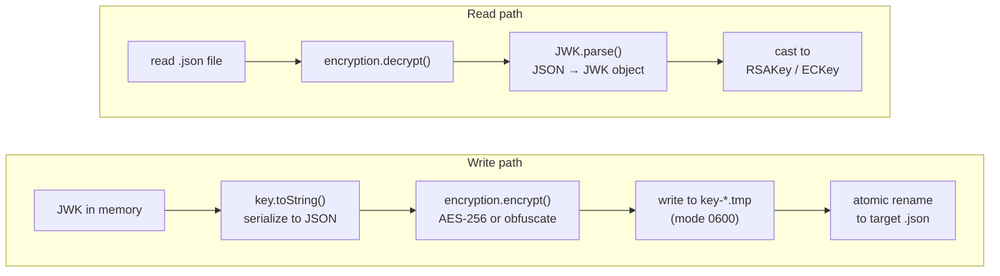

# Key Management

## Key rotation

To rotate keys, `POST` to `/admin/jwtKeyRotate.html` (requires `CHANGE_SERVER_SETTINGS` permission).

After rotation, the previous keys remain in the JWKS for one overlap window so in-flight tokens continue to verify. Only one generation of retired keys is kept — if you rotate twice in quick succession, tokens signed with the oldest key will fail verification. **Rotate no more frequently than your token TTL.**

Rotation is atomic: all new keys are generated in memory before any file is written. If key generation fails, the current keys are unchanged. Each file write uses a temp file followed by an atomic rename, so no reader ever sees a partially-written key file.

```mermaid
flowchart TD
    A([Trigger: POST /admin/jwtKeyRotate.html\nor cron schedule due]) --> B[Generate all new keys\nin memory]
    B --> C{Generation\nsuccessful?}
    C -- no --> D([Abort — current keys\nunchanged])
    C -- yes --> E[Promote current keys to retired\nretired-rsa-key.json\nretired-rsa3072-key.json\nretired-ec-key.json]
    E --> F[Write new keys\nrsa-key.json / rsa3072-key.json / ec-key.json\nvia temp file + atomic rename]
    F --> G[Update in-memory key store\natomically]
    G --> H([JWKS now includes current\n+ retired public keys])
```

Automatic rotation can be configured via a cron schedule in the plugin settings. The scheduler checks once per hour and triggers rotation if the next scheduled time has passed.

## Key storage and encryption

Private signing keys are stored in `<TeamCity data directory>/plugins-data/JwtBuildFeature/`. Files are restricted to owner read/write (0600 on Linux/macOS). On non-POSIX filesystems (e.g. Windows), permission restriction is skipped and the file is created with default OS permissions. If permission setting fails on a POSIX filesystem, the write is aborted and the existing keys are unchanged.

The plugin uses TeamCity's `Encryption` infrastructure to encrypt key files at rest:

- **With `TEAMCITY_ENCRYPTION_KEYS` set**: AES-256 encryption using a server-specific key. A file read from disk without that key (e.g. in a backup) cannot be decrypted.
- **Without a custom key**: the server's default scramble strategy is used (obfuscation only). File permissions are the sole meaningful protection in this case.

> **Warning:** Configuring `TEAMCITY_ENCRYPTION_KEYS` is required for any production deployment. Without it, the only protection on the private signing keys is the 0600 file permission on the data directory — and that protection does not travel with backups, snapshots, or anyone with shell access to the server. An attacker who recovers the deobfuscated key files can sign JWTs that every cloud account configured to trust this TeamCity (AWS roles, Azure federated credentials, Octopus service accounts, etc.) will accept.

To configure a custom encryption key, follow the [TeamCity Encryption Settings documentation](https://www.jetbrains.com/help/teamcity/teamcity-configuration-and-maintenance.html#encryption-settings). The `TEAMCITY_ENCRYPTION_KEYS` environment variable is the recommended approach — set it via the OS service manager so the key is never written to disk alongside the data it protects.

Every key file passes through the same pipeline on write and read:

