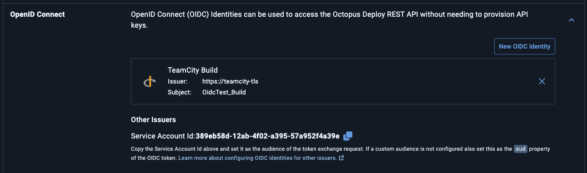

# Octopus Deploy Integration

In Octopus Deploy, go to **Configuration → Users → Your Service Account → OpenID Connect** and create a new OIDC Identity.

- Set the **issuer** to your TeamCity root URL.
- Set the **subject** to the build type external ID.
- Copy the **Service Account Id** and use it as the **Audience** in the build feature configuration.

