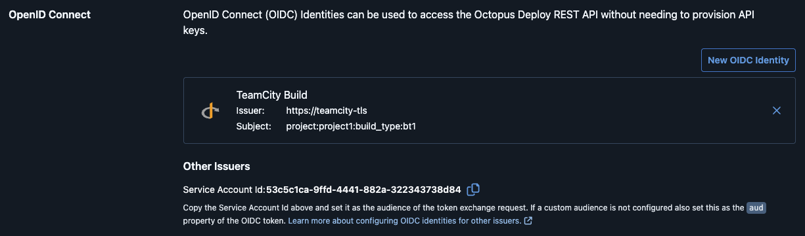

# Octopus Deploy Integration

In Octopus Deploy, go to **Configuration → Users → Your Service Account → OpenID Connect** and create a new OIDC Identity.

- Set the **issuer** to your TeamCity root URL, or to the value of **Override issuer URL** if one is configured under Administration → OIDC / JWT.
- Set the **subject** to the composite identifier that matches the tokens this build feature issues. The plugin emits `sub` in the form `project:<project_internal_id>:build_type:<build_type_internal_id>` with optional dimensions appended (see the [Subject claim reference](configuration.md#subject-claim)). The TeamCity internal IDs are visible in the build type's URL (`.../buildType/bt42`) and are immutable across renames.
- Copy the **Service Account Id** and use it as the **Audience** in the build feature configuration.



## Example subject values

| Build feature configuration | `sub` value | Octopus subject (exact match) |
|---|---|---|
| Default (branch + trigger_type enabled) | `project:project7:build_type:bt42:branch:refs/heads/main:trigger_type:user` | `project:project7:build_type:bt42:branch:refs/heads/main:trigger_type:user` |
| No optional dimensions | `project:project7:build_type:bt42` | `project:project7:build_type:bt42` |

Octopus supports wildcards in the subject (`*` for many characters, `?` for one). Trust any branch but require a user trigger by setting the subject to:

```
project:project7:build_type:bt42:branch:*:trigger_type:user
```

To trust every build that uses a given OIDC Identity Token connection, enable the **connection** subject dimension on the connection and set the subject to:

```
*:connection_project:project3:connection:PROJECT_EXT_12
```

This keeps working as sub-projects and build configurations are added under the connection's project, without new identities.

Prefer narrow patterns over broad wildcards to reduce the risk of unintended trust.
